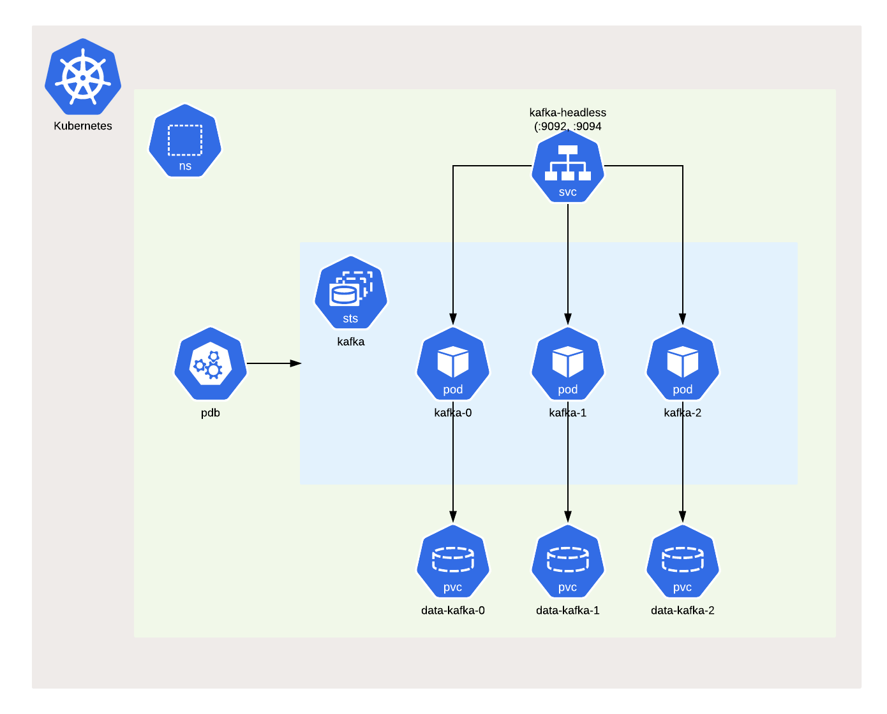

# Install Kafka with K8s


## [1] 설치
### Add Namespace
```commandline
kubectl create namespace kafka-demo
```

### Add repository
```commandline
helm repo add bitnami https://charts.bitnami.com/bitnami -n kafka-demo
```

### Install chart
- 3개의 broker 생성 요청
- 기본 SASL 프로토콜을 SASL_PLAINTEXT에서 PLAINTEXT로 바꾸어서 적용
- 22.0.0 이후 부터는 kraft 가 default로 설정
```commandline
helm install my-kafka --set replicaCount=3,listeners.client.protocol=PLAINTEXT bitnami/kafka --version 26.8.2 -n kafka-demo
```

### Delete chart
```commandline
helm delete my-kafka -n kafka-demo
```

### bitnami kafka helm Ref
https://artifacthub.io/packages/helm/bitnami/kafka

### helm-charts



## [2] 실행
### Kafka client 용 pod 실행
```commandline
kubectl run my-kafka-client --restart='Never' --image docker.io/bitnami/kafka:3.6.1-debian-11-r3 --namespace kafka-demo --command -- sleep infinity
```

### kafka client pod 접속
```commandline
kubectl exec --tty -i my-kafka-client --namespace kafka-demo -- bash
```

### PRODUCER
console producer를 실행 후 'hellow 123'을 입력
```commandline
kafka-console-producer.sh \
--broker-list my-kafka-controller-0.my-kafka-controller-headless.kafka-demo.svc.cluster.local:9092,my-kafka-controller-1.my-kafka-controller-headless.kafka-demo.svc.cluster.local:9092,my-kafka-controller-2.my-kafka-controller-headless.kafka-demo.svc.cluster.local:9092 \
--topic test
```

### CONSUMER
다른 cmd창을 통해 client pod에 접속 후, console consumer를 통해 'hellow 123' message 확인
```commandline
kafka-console-consumer.sh \
--consumer.config /tmp/client.properties \
--bootstrap-server my-kafka.kafka-demo.svc.cluster.local:9092 \
--topic test \
--from-beginning
```

